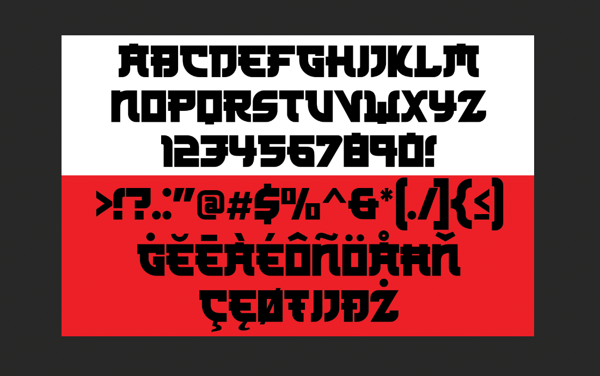

# Kamikaze

Kamikaze were a part of the Japanese Special Attack Units of military aviators who flew suicide attacks for the Empire of Japan against Allied naval vessels in the closing stages of the Pacific campaign of World War II, intending to destroy warships more effectively than with conventional air attacks. 

## Variable Font Axe

Kamikaze has the following axe:

Axis | Tag | Default | Static Instances
--- | --- | --- | ---
Weight | wght | 400 | Regular

## License

This Font Software is licensed under the SIL Open Font License, Version 1.1.
This license is available with a FAQ at [https://openfontlicense.org](https://openfontlicense.org)
